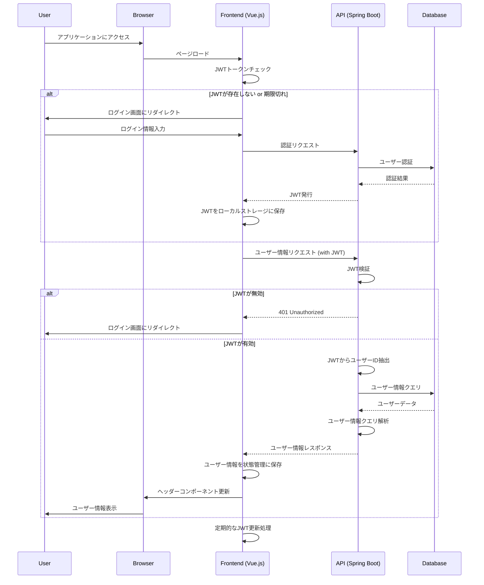

# ユーザー情報取得処理フロー

## 1. フロー図

## 2. 処理フローの詳細説明

1. **初期アクセス**:

   - ユーザーがブラウザでアプリケーションにアクセスします。
   - フロントエンド（Vue.js）アプリケーションがロードされます。

2. **トークンチェック**:

   - フロントエンドは、ブラウザのローカルストレージでアクセストークンの存在をチェックします。

3. **認証プロセス（トークンが存在しない場合）**:

   - トークンが存在しない場合、ユーザーはログイン画面にリダイレクトされます。
   - ユーザーがログイン情報を入力し、フロントエンドが認証リクエストを API に送信します。
   - API はデータベースでユーザーを認証し、成功時にアクセストークンを発行します。
   - フロントエンドは受け取ったトークンをローカルストレージに保存します。

4. **ユーザー情報リクエスト**:

   - フロントエンドは、保存されたトークンを使用して API にユーザー情報リクエストを送信します。

5. **トークン検証**:

   - API はリクエストに含まれるトークンの有効性を検証します。

6. **ユーザー情報取得（トークンが有効な場合）**:

   - トークンが有効な場合、API はデータベースからユーザー情報を取得します。
   - 取得した情報をフロントエンドにレスポンスとして返します。

7. **フロントエンド処理**:

   - フロントエンドは受け取ったユーザー情報を状態管理（例：Vuex）に保存します。
   - ヘッダーコンポーネントが更新され、ユーザー情報が表示されます。

8. **エラーハンドリング（トークンが無効な場合）**:

   - トークンが無効な場合、API は 401 Unauthorized エラーを返します。
   - フロントエンドはユーザーをログイン画面にリダイレクトします。

9. **定期的なトークン更新**:
   - フロントエンドは定期的（例：15 分ごと）にトークンの更新処理を行い、セッションを維持します。

## 3. セキュリティ考慮事項

- すべての API 通信は HTTPS 上で行われます。
- トークンは HttpOnly クッキーとして保存し、XSS 攻撃からの保護を強化します。
- トークンには適切な有効期限を設定し、定期的に更新します。
- ユーザー情報のキャッシュには、センシティブでない情報のみを含めます。

## 4. パフォーマンス最適化

- ユーザー情報は必要に応じてキャッシュし、不必要な API 呼び出しを減らします。
- トークン更新は非同期で行い、ユーザーエクスペリエンスへの影響を最小限に抑えます。

## 5. エラーハンドリング

- ネットワークエラーや予期せぬサーバーエラーに対して、適切なエラーメッセージをユーザーに表示します。
- リトライロジックを実装し、一時的な接続問題に対応します。

この処理フローに従うことで、セキュアで効率的なユーザー情報の取得と表示を実現できます。
