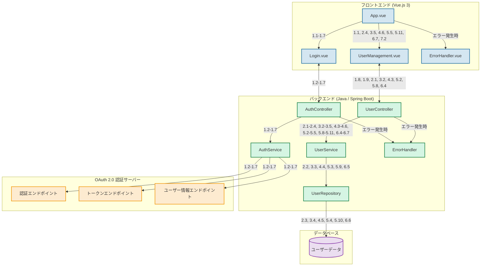
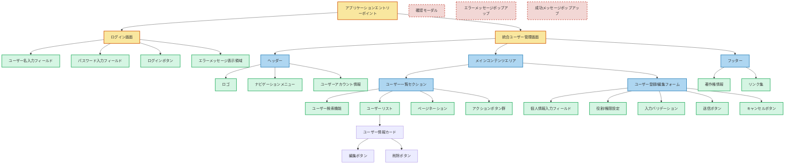
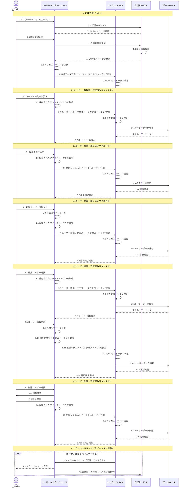

## 1. はじめに

このドキュメントは、ユーザー管理機能の詳細設計書です。システム構成、画面構成、および処理フローを含みます。

## 2. システム構成

## 3. 画面構成

## 4. 処理フロー

### 説明

1. **初期認証プロセス**:

   - ユーザーがアプリケーションにアクセスし、認証情報を入力
   - 認証サービスが情報を検証し、アクセストークンを発行
   - UI がトークンを保存し、初期データ取得リクエストを送信

2. **ユーザー一覧取得**:

   - ユーザーが一覧表示を要求
   - UI が保存されたトークンを使用して API にリクエスト
   - API がトークンを検証し、データベースからユーザーデータを取得

3. **ユーザー検索**:

   - ユーザーが検索クエリを入力
   - UI がトークン付きで検索リクエストを送信
   - API が検索を実行し、結果を返却

4. **ユーザー登録**:

   - ユーザーが新規ユーザー情報を入力
   - UI がバリデーションを行い、トークン付きで登録リクエストを送信
   - API がユーザーデータを保存

5. **ユーザー編集**:

   - ユーザーが編集対象を選択し、情報を更新
   - UI がバリデーションを行い、トークン付きで更新リクエストを送信
   - API がユーザーデータを更新

6. **ユーザー削除**:

   - ユーザーが削除対象を選択し、確認
   - UI がトークン付きで削除リクエストを送信
   - API がユーザーデータを削除

7. **エラーハンドリング**:
   - トークン無効やその他のエラーが発生した場合
   - API がエラーレスポンスを返し、UI がユーザーにメッセージを表示
   - 必要に応じて再認証プロセスを開始

この処理フローにより、セキュアで効率的なユーザー管理システムの動作を実現します。各プロセスでアクセストークンを使用することで、認証済みユーザーのみがシステムにアクセスできることを保証します。
