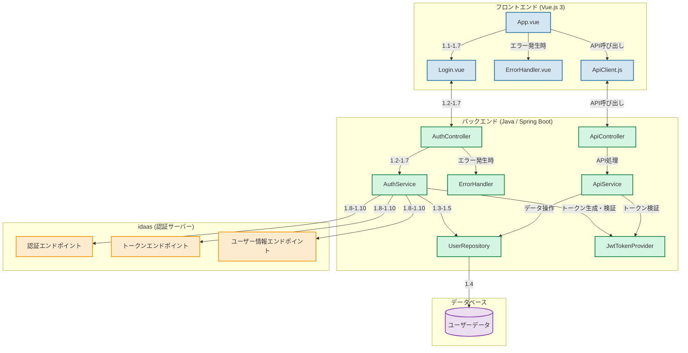
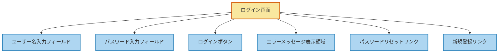
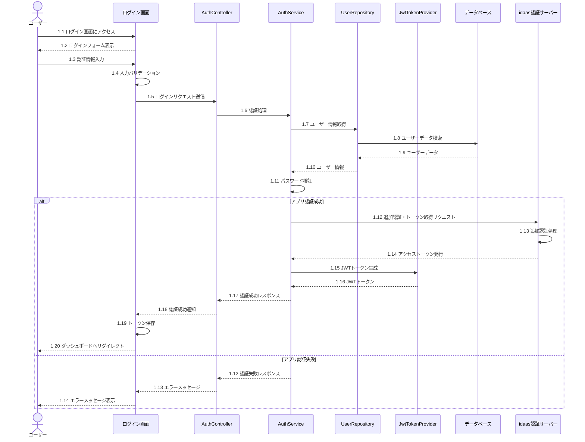
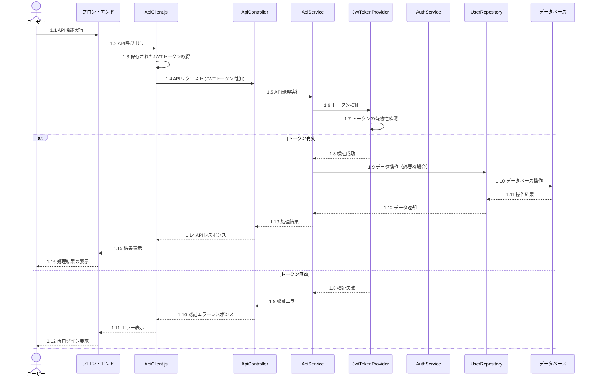

# ログイン機能および API 実行詳細設計書（完全版・修正）

## 1. はじめに

本文書は、ユーザー管理システムのログイン機能及び API 実行に関する詳細設計を記述したものです。アプリ側で管理しているユーザー ID とパスワードの認証を行い、その後 idaas サービスを利用して追加の認証やアクセス管理を行う設計となっています。また、認証後の API 実行フローについても記述しています。

## 2. システム構成

## 3. 画面構成

## 4. 処理フロー

### 4.1 ログインフロー

### 4.2 API 実行フロー

## 5. 詳細仕様

### 5.1 フロントエンド (Vue.js 3)

#### 5.1.1 Login.vue コンポーネント

- ユーザー名入力フィールド
  - タイプ: text
  - バリデーション: 必須、最大長 50 文字
- パスワード入力フィールド
  - タイプ: password
  - バリデーション: 必須、最小 8 文字、最大 32 文字
- ログインボタン
  - クリック時: ログイン処理実行
- エラーメッセージ表示領域
  - 認証失敗時にメッセージを表示
- パスワードリセットリンク
  - クリック時: パスワードリセット画面へ遷移
- 新規登録リンク
  - クリック時: ユーザー登録画面へ遷移

#### 5.1.2 ErrorHandler.vue コンポーネント

- エラー種別に応じたメッセージ表示
- ネットワークエラー、サーバーエラー、認証エラーの処理

#### 5.1.3 ApiClient.js

- 機能: バックエンド API との通信を担当
- 主要メソッド:
  1. setToken(token)
     - JWT トークンをローカルストレージに保存
  2. getToken()
     - 保存された JWT トークンを取得
  3. removeToken()
     - 保存された JWT トークンを削除
  4. get(url, params)
     - GET リクエストを送信
  5. post(url, data)
     - POST リクエストを送信
  6. put(url, data)
     - PUT リクエストを送信
  7. delete(url)
     - DELETE リクエストを送信
- 全てのリクエストに JWT トークンを自動的に付加
- トークン無効時の再ログイン処理

### 5.2 バックエンド (Java / Spring Boot)

#### 5.2.1 AuthController

- エンドポイント: `/api/auth/login`
- メソッド: POST
- 入力:
  - ユーザー名
  - パスワード
- 処理:
  - AuthService.authenticate() を呼び出し
- 出力:
  - 成功時: JWT トークン、ユーザー情報
  - 失敗時: エラーメッセージ、HTTP ステータスコード

#### 5.2.2 AuthService

- 主要メソッド:

  1. authenticate(String username, String password)

     - 機能: ユーザー名とパスワードによる認証
     - 処理:
       - UserRepository からユーザー情報を取得
       - パスワードの検証
       - IDaaS での追加認証
     - 戻り値: Authentication オブジェクト

  2. login(Authentication authentication)

     - 機能: 認証成功後のログイン処理
     - 処理:
       - JWT アクセストークンの生成
       - JWT リフレッシュトークンの生成
     - 戻り値: LoginResponse (アクセストークン、リフレッシュトークン、ユーザー名、権限を含む)

  3. logout(String token)

     - 機能: ログアウト処理
     - 処理:
       - JWT トークンの無効化
       - IDaaS でのログアウト処理

  4. validateToken(String token)

     - 機能: トークンの検証
     - 処理:
       - JWT トークンの検証
       - ユーザー情報の取得
       - IDaaS でのトークン検証
     - 戻り値: Authentication オブジェクト

  5. getUserDetailsFromToken(String token)

     - 機能: トークンからユーザー詳細情報を取得
     - 処理:
       - JWT トークンの検証
       - ユーザー情報の取得
       - IDaaS からのユーザー詳細情報取得
     - 戻り値: UserDetails オブジェクト

  6. isTokenValid(String token)

     - 機能: トークンの有効性確認
     - 処理:
       - JWT トークンの検証
       - IDaaS でのトークン検証
     - 戻り値: boolean

  7. refreshAccessToken(String refreshToken)
     - 機能: アクセストークンの更新
     - 処理:
       - リフレッシュトークンの検証
       - ユーザー情報の取得
       - IDaaS での新しいアクセストークン取得
       - アプリケーションの新しいアクセストークン生成
     - 戻り値: 新しいアクセストークン

#### 5.2.3 ErrorHandler

- AuthController の例外をキャッチし、適切なエラーレスポンスを生成

#### 5.2.4 UserRepository

- メソッド: findByUsername(String username)
- 処理:
  1. データベースからユーザー情報を取得
  2. ユーザーが存在しない場合、空の Optional を返す

#### 5.2.5 JwtTokenProvider

- 主なメソッド:
  - generateAccessToken(UserDetails userDetails)
  - generateRefreshToken(UserDetails userDetails)
  - validateToken(String token)
  - getUsernameFromToken(String token)
  - validateRefreshToken(String refreshToken)

#### 5.2.6 ApiController

- 各 API エンドポイントの定義
- リクエストの受付とレスポンスの返却
- ApiService を使用した実際の処理の実行

#### 5.2.7 ApiService

- API の具体的な処理ロジックの実装
- UserRepository を使用したデータ操作
- ビジネスロジックの実装
- JwtTokenProvider を使用したトークンの検証

### 5.3 idaas 認証サーバー

- 役割: アプリケーションの認証後、追加の認証やアクセス管理を提供
- 認証エンドポイント: `/oauth/
